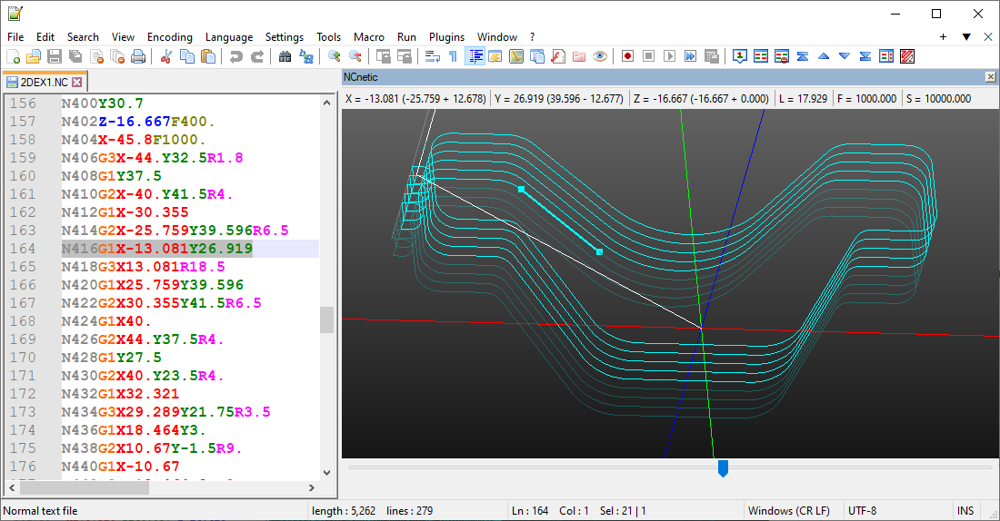

# NCneticNpp — Gcode CNC backplot/simulation plugin for Notepad++

A Notepad++ plugin to plot gcode files directly in the best code editor.
  

  

How it works?
-------------

Open a numerical control file and use the **Plot/Refresh** command of the plugin to simulate the corresponding toolpath. You can set the default 3D view and the styling (text coloring) in the options.

Manual installation
-----------------

1. Download the plugin: https://www.ncnetic.com/NCneticNpp.zip

2. Locate the Notepad++ plugins folder: 
    * **32-bit**: C:\Program Files (x86)\Notepad++\plugins 
    * **64-bit**: C:\Program Files\Notepad++\plugins

3. Add the corresponding plugin file: 
    * **32-bit**: C:\Program Files (x86)\Notepad++\plugins\NCneticNpp\NCneticNpp.dll
    * **64-bit**: C:\Program Files\Notepad++\plugins\NCneticNpp\NCneticNpp.dll

Additional information
----------------------

NCnetic website: https://ncnetic.com

3d graphics module : https://github.com/opentk

Notepad++ plugin template : https://github.com/kbilsted/NotepadPlusPlusPluginPack.Net

And last be not least, Notepad++ himself : https://github.com/notepad-plus-plus/notepad-plus-plus

Thanks to all contributors!
